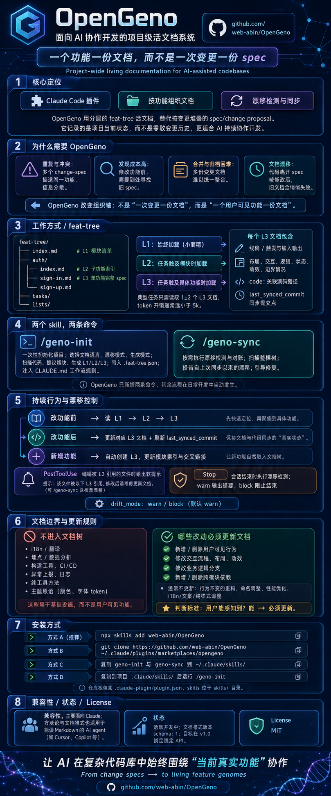

# OpenGeno

> 面向 AI 协作开发的项目级活文档系统。
> 一个功能一份文档，而不是一次变更一份 spec。

[English](README.md)

<p align="center">
  
</p>

## 为什么造这个

[openspec](https://github.com/Fission-AI/OpenSpec) 和 [GitHub spec-kit](https://github.com/github/spec-kit)
这类「需求驱动」的工作流，是把工作组织在**变更**这一维度上：每条需求
对应一份 spec / change proposal，走审阅、实现、归档流程。在做这条变更的
那一刻这套流程是有效的，但随着项目长大会暴露 4 个结构性问题：

1. **重复与冲突**。多份 change-spec 涉及同一个功能，每份都从一个角度
   描述。后人想了解这个功能要做三角定位。
2. **发现成本**。要修功能 X 之前，得先确认有没有历史 spec 提到过 X，
   在哪。
3. **合并和归档**。多个 spec 涉及同一个功能时，谁来合，合到哪？
4. **漂移**。一旦代码绕开 spec 流程被改了（用户手改、vibe coding），
   spec 就静悄悄地过期了。

OpenGeno 换了一个轴。不是「一次变更一份文档」，而是
**一个用户可见功能一份文档**，组织成项目根目录下的一棵分层文档树。
这棵树记录的是**项目当前的状态**，不是变更的历史。变更修改这棵树，
而不是在它旁边累积。

## 工作方式

项目里多出一个 `feat-tree/` 目录：

```
feat-tree/
├── index.md                # L1 — 模块清单（~500 token）
├── auth/
│   ├── index.md            # L2 — auth 模块下的子功能
│   ├── sign-in.md          # L3 — 单个功能的完整 spec
│   └── sign-up.md
├── tasks/
│   └── ...
└── lists/
    └── ...
```

三层，按需加载：

- **L1** — 始终加载（很小）
- **L2** — 任务涉及到该模块时加载
- **L3** — 任务涉及到具体功能时加载

一个典型任务只读 1–2 个 L3 文档，token 开销远小于 5k。

每份 L3 文档包含：

- 线稿（UI 功能）或触发条件 + 输入输出块（逻辑功能）
- 布局、交互、逻辑、状态机、动效、边界情况
- `code:` frontmatter 字段：相关源码路径列表
- `last_synced_commit`：该文档与代码达成一致时的 git commit

当 `code:` 里某个文件在该 SHA 之后被修改，
[漂移检测脚本](skills/geno-init/scripts/drift-check.sh)
会把这份文档标为"待复核"。

## 两个 skill，两条命令

OpenGeno 只新增两条 slash 命令。其他所有事情——改之前先读、改完之后更新、
新增功能——都自动发生，因为 `/geno-init` 会把工作流规则注入到你的
`CLAUDE.md`（以及 `AGENTS.md`，如果存在），随 skill 安装的 hook 强化执行。

| 命令 | 用途 |
|------|------|
| [`/geno-init`](skills/geno-init/SKILL.md) | 一次性项目初始化。询问文档语言（English / 中文）、漂移模式、以及生成模式（默认只生成骨架；也可选一次性生成完整文档），扫描代码、提议模块、生成 L1 + L2 + L3，写入 `.feat-tree.json`、把工作流规则注入 `CLAUDE.md`。 |
| [`/geno-sync`](skills/geno-sync/SKILL.md) | 按需漂移检测与对账。扫整棵树、报告自上次同步以来的漂移、引导你修复。 |

## 不需要命令的持续行为

`/geno-init` 跑完之后，你的 `CLAUDE.md` 里就有了工作流契约。之后每一次
对话，AI 都会自动：

- **改功能行为之前**——沿 L1 → L2 → L3 读到对应的功能文档。
- **改完功能行为之后**——同一对话内更新 L3 文档并刷新
  `last_synced_commit`。
- **新增功能时**——从随 skill 一起安装的模板（按所选语言）创建 L3 文档、
  更新 L2 模块索引、补齐入向跨链接。

两个 Claude Code hook 兜底：

- **`PostToolUse` 监听 Edit/Write**——你修改的文件被某个 L3 文档引用时
  会软提示。
- **`Stop`**——会话结束时运行漂移检测。`warn` 模式打印摘要；`block`
  模式在漂移未处理前不允许结束。

模式是项目级配置，写在 `.feat-tree.json` 里（`drift_mode: "warn"` 或
`"block"`），默认 `warn`。

## 文档语言

`/geno-init` 会在初始化时问一次：English 还是 中文。无论你选哪个，
**整棵文档树**都用那种语言生成——标题、正文、占位符、注入到 CLAUDE.md
的工作流规则、以及之后通过工作流创建或修改的所有文档。

注入到 CLAUDE.md 的规则会指示 AI 在后续对话里继续使用所选语言，所以
语言选择会自动延续，不需要你重复说明。

## 哪些不该进文档树

- i18n / 翻译
- 埋点 / 数据分析
- 构建工具、CI/CD
- 异常上报（Sentry、Crashlytics 等）
- 日志
- 纯工具方法
- 主题原语（颜色、字体 token）

这些是基础设施，不是用户可见的功能，应该在 CLAUDE.md / ADR / 代码注释
里说明，不进文档树。

## 哪些代码改动要更新文档

| 改动类型 | 是否更新文档 |
|---------|-------------|
| 新增 / 删除用户可见行为 | **必须** |
| 修改交互流程、布局、动效 | **必须** |
| 修改业务逻辑分支（条件、规则） | **必须** |
| 新增 / 删除跨模块依赖 | **必须（双方都要）** |
| 修 bug，新代码符合原文档描述 | 不更新 |
| 修 bug 但行为变了（即使是修对的方向） | **必须** |
| 重构 / 改命名 / 抽函数（行为不变） | 不更新 |
| 性能优化（行为不变） | 不更新 |
| i18n、文案、纯样式调整 | 不更新 |

判断标准：用户能不能感知到？能 → 必须更新。

## 安装

OpenGeno 是 Claude Code 插件（仓库根有 `.claude-plugin/plugin.json`，
skills 在 `skills/` 下）。

### 方式 A：用 `skills` CLI（推荐）

```bash
npx skills add web-abin/OpenGeno
```

### 方式 B：以插件方式安装

```bash
git clone https://github.com/web-abin/OpenGeno ~/.claude/plugins/marketplaces/opengeno
```

Claude Code 会自动加载 `~/.claude/plugins/marketplaces/` 下的所有插件。

### 方式 C：全局 skill 安装

把两个 skill 目录复制到全局 skill 目录：

```bash
mkdir -p ~/.claude/skills
cp -r /path/to/OpenGeno/skills/geno-init ~/.claude/skills/
cp -r /path/to/OpenGeno/skills/geno-sync ~/.claude/skills/
```

### 方式 D：项目级 skill 安装

只装到某一个项目里：

```bash
cd /path/to/your-project
mkdir -p .claude/skills
cp -r /path/to/OpenGeno/skills/geno-init .claude/skills/
cp -r /path/to/OpenGeno/skills/geno-sync .claude/skills/
```

任意一种装好后，在 Claude Code 里项目下跑 `/geno-init`。

## 兼容性

OpenGeno 主要面向 **Claude Code**，使用它的 hooks 系统做漂移管控。
方法论和文档格式本身在任何能读 markdown 的 AI agent（Cursor、Copilot
等）上都通用——只是只有 Claude Code 上能自动检测漂移。其他 agent 上可以
人工运行 `/geno-sync` 当作定期体检。

## 设计文档

想了解 OpenGeno 为什么这样设计（不只是怎么用），见 [`docs/`](docs/) ——
设计原理、架构说明、每个非显然决策的 ADR（英文）。

## 状态

活跃开发中。文档格式版本为 `schema: 1`。目标在 v1.0 锁定稳定 API——
schema 不兼容变更会随 `/geno-sync` 提供迁移路径。

## License

MIT — 见 [LICENSE](LICENSE)。
